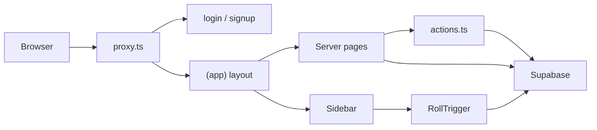

# Architecture

Quest Plus is a Next.js 16 App Router app with TypeScript, Tailwind CSS v4, and shadcn/ui primitives under `src/components/ui/`. Data and Auth are Supabase (Postgres + Row Level Security). There is no separate API layer: Server Components and Server Actions talk to Postgres through the Supabase client.

It is a campaign manager, not a live virtual tabletop. Recap **Sessions** are markdown notes. Dice live on **Rolls**. Game Events are a DM-only audit of sheet and inventory changes.

## Stack

- **Next.js 16** (App Router) + **React 19** + **TypeScript**
- **Tailwind CSS v4** + **shadcn/ui** (Radix) + **lucide-react** + **sonner** toasts
- **Supabase** (`@supabase/ssr`, `@supabase/supabase-js`) for Auth, Postgres, RLS, and Realtime (Rolls only)
- **Vitest** for unit tests (`src/**/*.test.ts`)
- Skill trees are custom SVG/layout in `SkillTreeView` / `TreeEditor`, not React Flow

Config is minimal: [`next.config.ts`](../next.config.ts) is empty besides the type. Path alias `@/` maps to `src/`.

## Request flow

1. [`src/proxy.ts`](../src/proxy.ts) runs on matched requests (Next.js 16 request interceptor; there is no `middleware.ts`). It refreshes the Auth cookie and redirects unauthenticated users to `/login`, and signed-in users away from `/login` and `/signup`.
2. [`src/app/layout.tsx`](../src/app/layout.tsx) is the root shell (fonts, global CSS, `Toaster`).
3. Authenticated UI lives in the `(app)` route group. [`src/app/(app)/layout.tsx`](../src/app/(app)/layout.tsx) loads the profile, redirects if missing, then renders `RollAlerts`, `Sidebar`, and the page.
4. Pages are Server Components. They call `requireSession` / `requireDm` and query Supabase with [`createClient`](../src/lib/supabase/server.ts).
5. Most mutations go through [`src/app/actions.ts`](../src/app/actions.ts) (`"use server"`). **Rolls** are the exception: the browser client inserts into `rolls` after computing faces locally.

## Data paths

**Reads.** Server Components use the server Supabase client. That client sets `cache: "no-store"` on fetch so campaign data is not served stale from the Next cache. RLS still filters rows (Players do not see other PCs or enemies; they do not see others’ Private Rolls).

**Writes.** Actions use the same cookie-backed client, so they run as the signed-in user. Game rules that must not be bypassed in the Data API live in Postgres:

- Column grants on `characters` (DM-owned fields are not updatable via the table)
- `character_skills` is RPC-only
- Inventory quantity and transfers go through RPCs
- Hidden item effects are stripped on read via `list_inventory` / `list_visible_inventory`

**Realtime.** Only `public.rolls` is in the `supabase_realtime` publication. [`RollAlerts`](../src/components/roll-alerts.tsx) subscribes to inserts. RLS on SELECT applies to the payload: a Player never receives another Player’s Private Roll. The stored row is the source of truth; a failed subscribe does not block a successful insert.

## Layouts and chrome

| Layer | Responsibility |
| --- | --- |
| Root layout | Metadata, fonts, `Toaster` |
| `(app)` layout | Session gate, sidebar, live Roll alerts |
| `Sidebar` | Role-based nav, Roll trigger, sign out |
| Login / signup | Full-page forms outside `(app)` |

## Conventions

- Domain words from `CONTEXT.md`; do not call the DM “admin” or Rolls “checks”.
- `ActionResult` is `{ ok: true } | { ok: false; error: string }`. Callers toast `error`.
- Sensitive checks are duplicated in SQL (`private.is_dm()`, `private.can_edit_character`, RPC `security definer`). UI gates are convenience, not the security boundary.
- Generated table/RPC types live in [`src/lib/database.types.ts`](../src/lib/database.types.ts).
